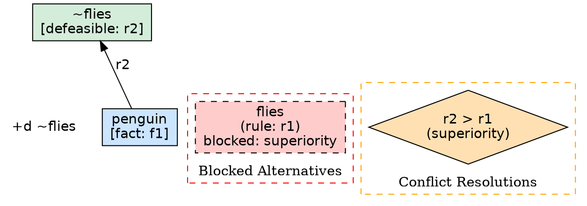

# Explanation System

Spindle provides a comprehensive explanation system for inspecting how and why conclusions are derived in defeasible reasoning. When a reasoner produces a conclusion, understanding the derivation path, the alternatives that were considered and rejected, and the conflicts that were resolved is essential for trust, debugging, and auditability.

## Why Explanations Matter

Defeasible reasoning involves rules that can be overridden, conflicts between competing conclusions, and subtle interactions between superiority relations. A bare conclusion like `+d ~flies` tells you the result but not the story. The explanation system answers questions such as:

- Which rules fired to produce this conclusion?
- Were there competing rules that were defeated?
- How were conflicts resolved -- by superiority, definite priority, or team defeat?
- What is the full derivation chain from facts to conclusion?

This is critical in domains like legal reasoning, medical diagnosis, and access control where decisions must be justified.

## Proof Trees

### Structure

An explanation is built around a **proof tree**: a recursive structure that traces the derivation of a literal back to the facts and rules that support it.

The core types are:

- `ProofNode` -- represents the derivation of a single literal, containing:
  - `literal` -- the derived literal
  - `derivation_type` -- `Definite` (strict rules and facts only) or `Defeasible` (defeasible rules involved)
  - `proof_step` -- the rule application that produced this literal
  - `blocked_alternatives` -- alternative derivations that were considered but rejected
  - `conflicts_resolved` -- conflict resolutions that occurred at this node

- `ProofStep` -- represents one application of a rule, containing:
  - `rule_label` -- which rule was applied
  - `rule_type` -- `Fact`, `Strict`, `Defeasible`, or `Defeater`
  - `rule_text` -- string representation of the rule
  - `body_proofs` -- recursive `ProofNode` entries for each body literal
  - `annotations` -- metadata attached to the rule

- `DerivationType` -- either `Definite` or `Defeasible`

### Navigating Proof Trees

A proof tree reads from conclusion down to facts. At each node, the `proof_step` tells you which rule was used, and the `body_proofs` within that step give you the sub-trees for each premise.

For example, given a theory where `penguin` is a fact, `penguin -> bird` is strict, and `bird => flies` is defeasible, the proof tree for `flies` would look like:

```
flies [defeasible, r1: bird => flies]
  bird [definite, s1: penguin -> bird]
    penguin [definite, f1: >> penguin]
```

Each level corresponds to a `ProofNode` whose `proof_step.body_proofs` contains the children.

## Blocked Alternatives and Conflict Resolutions

### Blocked Alternatives

When the reasoner considers multiple rules that could derive a literal (or its complement), some may be blocked. A `BlockedProof` records:

- `literal` -- what the blocked rule tried to prove
- `rule_label` -- the label of the blocked rule
- `reason` -- a `BlockReason` enum value:
  - `Superiority` -- blocked by a superior rule
  - `Defeater` -- blocked by a defeater
  - `Conflict` -- blocked due to an unresolved conflict
  - `BodyUnprovable` -- the rule's body could not be satisfied
- `blocking_rule` -- the label of the rule that caused the blocking (if applicable)
- `explanation` -- a human-readable description

### Conflict Resolutions

When two rules derive contradictory conclusions, the conflict must be resolved. A `ConflictResolution` records:

- `winning_rule` -- the rule that prevailed
- `losing_rule` -- the rule that was defeated
- `resolution_type` -- a `ResolutionType` enum value:
  - `Superiority` -- resolved by an explicit superiority relation
  - `DefinitePriority` -- resolved because strict rules override defeasible ones
  - `TeamDefeat` -- resolved by team defeat (a group of rules collectively defeats the attacker)

Together, blocked alternatives and conflict resolutions provide a complete picture of why one derivation was chosen over another.

## Output Formats

The `Explanation` type supports four output formats, each suited to different use cases.

### Natural Language

```rust
let text = explanation.to_natural_language();
println!("{}", text);
```

Produces human-readable output with headers, indented proof trees, and numbered lists:

```
Explanation for +d ~flies
This was proven using defeasible rules and was not defeated by any conflicting rule.

Derivation:
  1. "~flies" was derived defeasibly
     Using defeasible rule: r2
     Prerequisites:
       1. "penguin" was established as a fact
          Using fact: f1

Blocked Alternatives:
  1. Rule 'r1' was blocked due to superiority: r2 is superior and concludes ~flies

Conflict Resolutions:
  1. 'r2' defeated 'r1' via superiority
```

Annotations (description and source) are included when present on proof steps.

### JSON

```rust
let json = explanation.to_json();
```

Produces a structured JSON value with nested proof trees:

```json
{
  "conclusion_type": "+d",
  "literal": "~flies",
  "proof_tree": {
    "literal": "~flies",
    "derivation_type": "defeasible",
    "proof_step": {
      "rule_label": "r2",
      "rule_type": "defeasible",
      "rule_text": "penguin => ~flies",
      "body_proofs": [
        {
          "literal": "penguin",
          "derivation_type": "definite",
          "proof_step": {
            "rule_label": "f1",
            "rule_type": "fact",
            "rule_text": ">> penguin",
            "body_proofs": []
          }
        }
      ]
    }
  },
  "blocked_alternatives": [
    {
      "literal": "flies",
      "rule_label": "r1",
      "reason": "superiority",
      "blocking_rule": "r2",
      "explanation": "r2 is superior and concludes ~flies"
    }
  ],
  "conflicts_resolved": [
    {
      "winning_rule": "r2",
      "losing_rule": "r1",
      "resolution_type": "superiority",
      "superiority_label": "sup1"
    }
  ]
}
```

### JSON-LD

```rust
let jsonld = explanation.to_jsonld();
```

Produces a JSON-LD document with semantic annotations for integration with linked data systems. The output includes:

- `@context` defining vocabulary prefixes:
  - `spindle` -- `https://spindle.dev/ontology#`
  - `prov` -- `http://www.w3.org/ns/prov#`
  - `rdfs` -- `http://www.w3.org/2000/01/rdf-schema#`
  - `xsd` -- `http://www.w3.org/2001/XMLSchema#`
- `@type: "spindle:Explanation"` on the root document
- `@type: "spindle:ProofNode"` on proof nodes
- `@type: "spindle:ProofStep"` on proof steps
- `@type: "spindle:BlockedProof"` on blocked alternatives
- `@type: "spindle:ConflictResolution"` on conflict resolutions

Provenance annotations from rule metadata are mapped to standard vocabularies:

- `source` / `prov:wasAttributedTo` for attribution
- `description` / `rdfs:comment` for descriptions
- `confidence` / `spindle:confidence` for trust scores
- `@id` for linked data identifiers

### Graphviz DOT

```rust
let dot = explanation.to_dot();
```

Produces a DOT language graph for visual rendering. The color scheme encodes derivation semantics:

| Element | Shape | Color | Meaning |
|---------|-------|-------|---------|
| Definite derivation | Box | Blue (`#cce5ff`) | Derived via strict rules and facts |
| Defeasible derivation | Box | Green (`#d4edda`) | Derived via defeasible rules |
| Blocked alternative | Dashed box | Red (`#ffcccc`) | Derivation that was rejected |
| Conflict resolution | Diamond | Orange (`#ffe0b3`) | How a conflict was decided |

The graph uses bottom-to-top layout (`rankdir=BT`), so facts appear at the bottom and conclusions at the top. Edges are labeled with rule labels.

## Annotations and Metadata

### The Annotations Type

`Annotations` is a metadata container with two fields:

- `id` -- an optional URI identifier (`@id` in JSON-LD)
- `entries` -- a `HashMap<String, String>` of key-value pairs

### Standard Vocabulary Keys

The annotation system recognizes standard vocabulary keys and provides convenience accessors that check multiple equivalent keys:

| Accessor | Keys Checked (in order) |
|----------|------------------------|
| `description()` | `description`, `dc:description`, `rdfs:comment` |
| `source()` | `source`, `dc:source`, `prov:wasAttributedTo` |
| `confidence()` | `confidence`, `spindle:confidence` |

You can also use `get(key)` for any arbitrary key, or `get_any(keys)` to check a list of fallback keys.

### Creating Annotations

```rust
use spindle_core::explanation::Annotations;

// Empty annotations
let annots = Annotations::new();

// With entries
let annots = Annotations::with_entries(vec![
    ("description", "Birds typically fly"),
    ("source", "ornithology-textbook"),
    ("confidence", "0.95"),
]);

// With a linked data identifier
let mut annots = Annotations::with_entries(vec![
    ("source", "legal-statute-42-usc-1983"),
]);
annots.id = Some("https://example.org/rules/r1".to_string());
```

### Attaching Annotations to Proof Steps

```rust
use spindle_core::explanation::{ProofStep, Annotations};
use spindle_core::rule::RuleType;

let annots = Annotations::with_entries(vec![
    ("source", "expert-knowledge"),
    ("description", "Standard medical practice guideline"),
    ("confidence", "0.85"),
]);

let step = ProofStep::new("med_rule", RuleType::Defeasible, "symptom => diagnosis")
    .with_annotations(annots);
```

Annotations are preserved across all output formats. In natural language, `description` and `source` are printed inline. In JSON-LD, they are mapped to `rdfs:comment`, `prov:wasAttributedTo`, and `spindle:confidence` respectively.

## CLI Usage

### The `explain` Command

Show the full derivation proof tree for a provable literal:

```bash
spindle explain "~flies" theory.spl
```

Output includes the derivation chain, blocked alternatives, and conflict resolutions in natural language format.

For machine-readable output:

```bash
spindle explain "~flies" theory.spl --json
```

### The `why-not` Command

Explain why a literal is NOT provable:

```bash
spindle why-not flies theory.spl
```

Lists each rule that could have derived the literal and explains why it was blocked (missing premises, defeated by a stronger rule, or contradicted by a strict derivation).

For machine-readable output:

```bash
spindle why-not flies theory.spl --json
```

The JSON output includes `is_provable` to indicate whether the literal is actually provable, and `would_derive` with the rule label when available.

### Debugging Workflow

A typical debugging session combines both commands:

```bash
# 1. Check what was concluded
spindle reason --positive theory.spl

# 2. A literal you expected is missing -- find out why
spindle why-not flies theory.spl

# 3. A literal you did not expect is present -- inspect its proof
spindle explain "~flies" theory.spl

# 4. Pipe JSON output to other tools for further analysis
spindle explain "~flies" theory.spl --json | jq '.blocked_alternatives'
```

## Rust API Examples

### Generating an Explanation

```rust
use spindle_core::explanation::explain;
use spindle_core::literal::Literal;
use spindle_core::theory::Theory;

let mut theory = Theory::new();
theory.add_fact("bird");
theory.add_defeasible_rule(&["bird"], "flies");

let literal = Literal::simple("flies");
if let Some(explanation) = explain(&theory, &literal) {
    // Natural language output
    println!("{}", explanation.to_natural_language());

    // Structured JSON
    let json = explanation.to_json();
    println!("{}", serde_json::to_string_pretty(&json).unwrap());

    // JSON-LD for semantic web
    let jsonld = explanation.to_jsonld();

    // Graphviz DOT for visualization
    let dot = explanation.to_dot();
}
```

The `explain` function returns `None` if the literal is not positively provable in the theory.

### Building Explanations Manually

For custom explanation construction (useful in testing or when building explanations outside the standard reasoning pipeline):

```rust
use spindle_core::explanation::*;
use spindle_core::conclusion::ConclusionType;
use spindle_core::literal::Literal;
use spindle_core::rule::RuleType;

// Build a proof tree bottom-up
let fact_step = ProofStep::new("f1", RuleType::Fact, ">> penguin");
let fact_node = ProofNode::new(Literal::simple("penguin"), DerivationType::Definite)
    .with_proof_step(fact_step);

let rule_step = ProofStep::new("r2", RuleType::Defeasible, "penguin => ~flies")
    .with_body_proofs(vec![fact_node]);
let conclusion_node = ProofNode::new(Literal::negated("flies"), DerivationType::Defeasible)
    .with_proof_step(rule_step);

// Record a blocked alternative
let blocked = BlockedProof::new(
    Literal::simple("flies"),
    "r1",
    BlockReason::Superiority,
    "Rule r2 is superior and concludes ~flies",
).with_blocking_rule("r2");

// Record a conflict resolution
let conflict = ConflictResolution::new("r2", "r1", ResolutionType::Superiority)
    .with_superiority("sup1");

// Assemble the explanation
let explanation = Explanation::new(
    ConclusionType::DefeasiblyProvable,
    Literal::negated("flies"),
)
.with_proof(conclusion_node)
.with_blocked(vec![blocked])
.with_conflicts(vec![conflict]);
```

### Inspecting Proof Trees Programmatically

```rust
fn walk_proof(node: &ProofNode, depth: usize) {
    let indent = "  ".repeat(depth);
    let dtype = match node.derivation_type {
        DerivationType::Definite => "definite",
        DerivationType::Defeasible => "defeasible",
    };
    println!("{}{} [{}]", indent, node.literal, dtype);

    if let Some(ref step) = node.proof_step {
        println!("{}  via rule: {}", indent, step.rule_label);

        if let Some(desc) = step.annotations.description() {
            println!("{}  description: {}", indent, desc);
        }

        for child in &step.body_proofs {
            walk_proof(child, depth + 1);
        }
    }
}

if let Some(ref tree) = explanation.proof_tree {
    walk_proof(tree, 0);
}
```

## Use Case: Visual Proof Graphs with DOT Output

The DOT output format integrates directly with Graphviz for generating visual proof graphs.

### Generating a Graph

```bash
# Generate DOT and render to PNG
spindle explain "~flies" theory.spl --json \
  | jq -r '.proof_tree' \
  > /dev/null  # Use the Rust API instead for DOT

# Or from Rust:
```

```rust
use spindle_core::explanation::explain;
use spindle_core::literal::Literal;
use std::fs;
use std::process::Command;

let literal = Literal::negated("flies");
if let Some(explanation) = explain(&theory, &literal) {
    let dot = explanation.to_dot();

    // Write DOT file
    fs::write("proof.dot", &dot).unwrap();

    // Render with Graphviz
    Command::new("dot")
        .args(["-Tpng", "proof.dot", "-o", "proof.png"])
        .status()
        .unwrap();

    // Or render to SVG for web embedding
    Command::new("dot")
        .args(["-Tsvg", "proof.dot", "-o", "proof.svg"])
        .status()
        .unwrap();
}
```

### Reading the Graph

The generated graph uses a consistent visual language:

- **Blue boxes** at the bottom represent facts and strict derivations. These are the foundation of the proof and cannot be defeated.
- **Green boxes** represent defeasible derivations. These are the conclusions that could potentially be overridden by new information.
- **Red dashed boxes** in the "Blocked Alternatives" cluster show derivations that were considered but rejected. The label includes the rule label and the reason for blocking.
- **Orange diamonds** in the "Conflict Resolutions" cluster show how conflicts between competing rules were resolved, including the winning and losing rules and the resolution mechanism.

Edges flow upward from premises to conclusions, labeled with the rule that was applied.

### Example DOT Output

For a penguin theory with `r2 > r1`:



## Use Case: Semantic Web Integration with JSON-LD

The JSON-LD output allows Spindle explanations to participate in the linked data ecosystem.

### Publishing Explanations as Linked Data

```rust
use spindle_core::explanation::{explain, Annotations, ProofStep};
use spindle_core::literal::Literal;

let literal = Literal::simple("liable");
if let Some(explanation) = explain(&theory, &literal) {
    let jsonld = explanation.to_jsonld();

    // Serialize for publication
    let output = serde_json::to_string_pretty(&jsonld).unwrap();
    println!("{}", output);
}
```

The resulting JSON-LD document can be:

- Consumed by any JSON-LD processor (e.g., `jsonld.js`, Apache Jena)
- Expanded, compacted, or flattened using standard JSON-LD algorithms
- Converted to RDF triples for storage in a triple store
- Queried with SPARQL alongside other linked data

### Provenance Tracking

When rules carry annotations with source and confidence information, the JSON-LD output maps these to standard provenance vocabulary:

```json
{
  "@context": {
    "spindle": "https://spindle.dev/ontology#",
    "prov": "http://www.w3.org/ns/prov#",
    "rdfs": "http://www.w3.org/2000/01/rdf-schema#",
    "xsd": "http://www.w3.org/2001/XMLSchema#"
  },
  "@type": "spindle:Explanation",
  "conclusionType": "+d",
  "literal": "liable",
  "proofTree": {
    "@type": "spindle:ProofNode",
    "literal": "liable",
    "derivationType": "defeasible",
    "proofStep": {
      "@type": "spindle:ProofStep",
      "@id": "https://example.org/rules/r1",
      "ruleLabel": "r1",
      "ruleType": "defeasible",
      "wasAttributedTo": "legal-statute-42-usc-1983",
      "rdfs:comment": "Civil rights violation implies liability",
      "spindle:confidence": "0.9"
    }
  }
}
```

### Linking to External Ontologies

By using standard vocabulary keys in annotations, you can link Spindle explanations to domain ontologies:

```rust
let mut annots = Annotations::with_entries(vec![
    ("dc:source", "https://www.law.cornell.edu/uscode/text/42/1983"),
    ("prov:wasAttributedTo", "https://example.org/agents/legal-expert"),
    ("rdfs:comment", "Section 1983 civil rights liability"),
]);
annots.id = Some("https://example.org/rules/civil-rights-liability".to_string());
```

This enables downstream systems to dereference rule sources, look up agent information, and integrate the explanation into a broader knowledge graph.

## Limitations

1. **Positive proofs only**: The `explain` function returns `None` for literals that are not positively provable. Use the `why-not` CLI command or the query module for negative explanations.
2. **Grounded theories**: Explanations work on grounded theories. Variables must be bound before explanation generation.
3. **No incremental updates**: Explanations are generated from a full reasoning pass. Changes to the theory require re-running the reasoner.
4. **Annotation attachment**: Annotations must be attached to proof steps manually when building explanations programmatically. The `explain` function does not yet automatically populate annotations from rule metadata.
